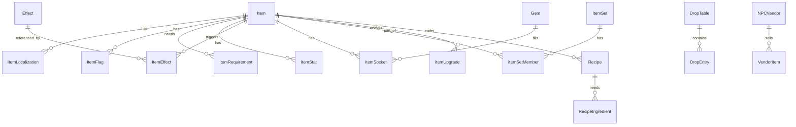

承知いたしました。MMOやRPGでアイテムを実装する際の、基本的なデータベース（スプレッドシートやテーブル）の見本を作成します。

この見本は、**回復アイテム**、**装備品**、**素材**の3種類をカバーし、それぞれに必要なコアな設定項目を含んでいます。

ここでは、Google Keepのリストではなく、項目名とデータ例をわかりやすい表形式で提示します。

---

### **アイテムデータベース（基本構造見本）**

| No. | 項目名 (Field Name) | データ型 (Type) | 説明 (Description) |
| :---- | :---- | :---- | :---- |
| 1 | **ItemID** | 整数 (INT) | アイテムを識別する一意のID |
| 2 | **アイテム名** | 文字列 (TEXT) | ユーザーに表示されるアイテムの名称 |
| 3 | **種別** | 文字列 (ENUM) | アイテムの大分類（例：消費、装備、素材、貴重） |
| 4 | **小種別** | 文字列 (ENUM) | アイテムの小分類（例：回復薬、片手剣、鉱石、クエストアイテム） |
| 5 | **レアリティ** | 整数 (INT) | 希少度（例：1=コモン、5=レジェンド） |
| 6 | **価格（販売）** | 整数 (INT) | NPCに売却する際の価格 |
| 7 | **価格（購入）** | 整数 (INT) | NPCから購入する際の価格（未販売の場合は0） |
| 8 | **スタック数** | 整数 (INT) | 1つのスロットに重ねて持てる最大数 |
| 9 | **説明文** | 文字列 (TEXT) | アイテムのフレーバーテキストや簡単な解説 |

---

### **1\. 消費アイテム（回復薬）のデータ例**

| ItemID | アイテム名 | 種別 | 小種別 | レアリティ | 価格（販売） | 価格（購入） | スタック数 | 説明文 |
| :---- | :---- | :---- | :---- | :---- | :---- | :---- | :---- | :---- |
| 1001 | **ポーション** | 消費 | 回復薬 | 1 | 50 | 100 | 99 | HPを少量回復する標準的な薬。 |
| 1002 | **ハイポーション** | 消費 | 回復薬 | 3 | 250 | 500 | 99 | HPを大きく回復する高品質な薬。 |
| 1003 | **エリクサー** | 消費 | 回復薬 | 5 | 1000 | 0 | 1 | HPとMPを全回復する伝説の霊薬。 |
| 1004 | **毒消し** | 消費 | 治療薬 | 2 | 30 | 60 | 99 | 毒状態を治癒するハーブ液。 |
| **効果データ** |  |  |  |  |  |  |  |  |
| 1001 | **HP回復量** | 50 |  |  |  |  |  |  |
| 1003 | **MP回復量** | 全回復 |  |  |  |  |  |  |
| 1004 | **状態異常** | 毒を治癒 |  |  |  |  |  |  |

### **2\. 装備品（武器・防具）のデータ例**

| ItemID | アイテム名 | 種別 | 小種別 | レアリティ | 装備箇所 | 最小レベル | 攻撃力 (ATK) | 防御力 (DEF) | 特殊効果 | 説明文 |
| :---- | :---- | :---- | :---- | :---- | :---- | :---- | :---- | :---- | :---- | :---- |
| 2001 | **鉄の剣** | 装備 | 片手剣 | 1 | 武器 | 1 | 10 | 0 | \- | 初心者向けの標準的な剣。 |
| 2002 | **ミスリルの鎧** | 装備 | 重鎧 | 4 | 胴体 | 30 | 0 | 50 | 魔法耐性+5% | 稀少な金属ミスリルで作られた鎧。 |
| 2003 | **俊足のブーツ** | 装備 | 靴 | 3 | 足 | 15 | 0 | 5 | 移動速度+10 | 履いた者を軽快にする魔法の靴。 |
| 2004 | **炎の大剣** | 装備 | 両手剣 | 5 | 武器 | 50 | 80 | 0 | 火属性攻撃追加 | 炎の魔石が埋め込まれた巨大な剣。 |

### **3\. 素材アイテムのデータ例**

| ItemID | アイテム名 | 種別 | 小種別 | レアリティ | 価格（販売） | スタック数 | 入手元 | 説明文 |
| :---- | :---- | :---- | :---- | :---- | :---- | :---- | :---- | :---- |
| 3001 | **鉄鉱石** | 素材 | 鉱物 | 1 | 10 | 99 | 採掘 | どこでも採れる一般的な鉱物。 |
| 3002 | **ドラゴンの鱗** | 素材 | 生体 | 4 | 500 | 50 | ドラゴン | 伝説のドラゴンから剥ぎ取った強靭な鱗。 |
| 3003 | **清めのハーブ** | 素材 | 植物 | 2 | 20 | 99 | 採取 | ポーションの原料となる薬草。 |

### **【補足：データベース設計のポイント】**

1. **分離と連携（リレーション）:**  
   * 上記の例では見やすいように一つにまとめていますが、実際には「アイテム基本情報」「装備品パラメータ」「消費アイテム効果」のようにテーブルを分離し、ItemIDで連携（リレーション）させるのが一般的です。  
2. **特殊効果の扱い:**  
   * 特殊効果（例：「移動速度+10」「魔法耐性+5%」）は、単純なテキストではなく、EffectID（効果ID）として別のテーブルに分離し、「効果の種類」「効果値」「発動確率」などを詳細に設定する設計が最も柔軟です。  
3. **装備制限:**  
   * 「装備箇所」「最小レベル」の他に、「職業制限」や「性別制限」などの項目が必要になる場合があります。  
4. **ローカライズ対応:**  
   * 多言語対応する場合、「アイテム名」や「説明文」のフィールドは、言語ごとに分けるか、TextID（テキストID）で外部のテキストデータベースを参照するように設計します。

---

## MMO向けアイテムデータ設計（実運用最適化）

MMO運用・スケール・ライブOpsを想定した拡張スキーマ例。分離・正規化とキャッシュ効率の両立を重視。

### 全体ER（簡略）

### 1. `Item`（コア）
| Field | Type | Note |
| :-- | :-- | :-- |
| ItemID | INT PK | サーバ決定ID（連番/雪花ID可） |
| Type | ENUM | consume, equip, material, quest, cosmetic, currency |
| SubType | ENUM | potion, sword, ore, chest, etc. |
| Rarity | TINYINT | 1–7（Common–Mythic等） |
| ItemLevel | SMALLINT | 内部ILv（スケーリング/比較用） |
| RequiredLevel | SMALLINT | 装備/使用必要Lv |
| StackMax | SMALLINT | 1, 20, 99 など |
| Weight | SMALLINT | 持ち運び/移動計算で使用（任意） |
| BindType | ENUM | none, on_pickup, on_equip, account_bind |
| Tradable | BOOL | 取引可否（オークション/直接取引） |
| UniqueEquip | BOOL | 同名同時装備制限 |
| CooldownSec | SMALLINT | 使用CD（消費/トリガー） |
| DurationSec | INT | 時限アイテム（任意） |
| IconPath | TEXT | `Assets/Art/Icons/...` |
| PrefabPath | TEXT | `Assets/Prefabs/...` |
| AddressableKey | TEXT | ランタイムロード用キー |
| AppearanceID | INT | トランスモグ/見た目共有ID |
| Version | INT | データ版数（ロールバック用） |
| ActiveFrom | DATETIME | 開始（イベント/シーズン） |
| ActiveTo | DATETIME | 終了（終了未設定はNULL） |
| Deprecated | BOOL | 配布停止フラグ |

### 2. `ItemLocalization`
| Field | Type | Note |
| :-- | :-- | :-- |
| ItemID | INT FK | |
| Locale | CHAR(5) | ja-JP, en-US |
| Name | TEXT | 表示名 |
| Description | TEXT | 説明文 |

### 3. `ItemFlag`
| Field | Type | Note |
| :-- | :-- | :-- |
| ItemID | INT FK | |
| Flag | ENUM | no_drop, no_sell, no_destroy, pvp_only, seasonal, cashshop |

### 4. `ItemRequirement`
| Field | Type | Note |
| :-- | :-- | :-- |
| ItemID | INT FK | |
| ReqType | ENUM | class, gender, faction, quest, reputation, achievement |
| ReqValue | TEXT | 例: `Warrior`, `Q_12345`, `Reputation>=Honored` |

### 5. `ItemStat`（装備/補正値）
| Field | Type | Note |
| :-- | :-- | :-- |
| ItemID | INT FK | |
| Stat | ENUM | ATK, DEF, HP, MP, CRIT, HASTE, RES_FIRE 等 |
| Value | INT | 基礎値 |
| IsPercent | BOOL | ％扱いか |

### 6. `Effect` / `ItemEffect`
Effect（マスタ）
| Field | Type | Note |
| :-- | :-- | :-- |
| EffectID | INT PK | |
| Category | ENUM | heal, buff, debuff, proc, summon, script |
| ParamSchema | JSON | `{"amount":"int","duration":"sec"}` 等 |

ItemEffect（紐付け）
| Field | Type | Note |
| :-- | :-- | :-- |
| ItemID | INT FK | |
| EffectID | INT FK | |
| Trigger | ENUM | on_use, on_equip, on_hit, on_proc |
| Chance | DECIMAL(5,2) | 0–100（%） |
| Params | JSON | 実値（例: `{ "amount": 500 }`） |

### 7. ソケット/ジェム
`ItemSocket(ItemID, SocketIndex, Color)` / `Gem(GemID, Color, Stat/Effect...)`

### 8. セット/アップグレード
`ItemSet(ItemSetID, Name)` / `ItemSetMember(ItemSetID, ItemID, BonusIndex)`
`ItemUpgrade(FromItemID, ToItemID, CostCurrencyID, CostAmount)`

### 9. 取得・経済
- **Drop**: `DropTable(TableID, Name, LevelRange, Seasonal)` / `DropEntry(TableID, ItemID, Weight, MinQ, MaxQ)`
- **Vendor**: `NPCVendor(VendorID, Name, Faction)` / `VendorItem(VendorID, ItemID, Price, CurrencyID, Stock, ReqReputation)`
- **Craft**: `Recipe(RecipeID, ResultItemID, ResultQty, TimeSec)` / `RecipeIngredient(RecipeID, IngredientItemID, Qty)`
- **Price**: `ItemPrice(ItemID, Buy, Sell, TaxGroup, RepairCostPerDur)`

### 10. 耐久/修理（任意）
`ItemDurability(ItemID, MaxDur, RepairNPCOnly BOOL)`

### 11. 監査/改訂
`ItemAudit(ItemID, Version, ChangedAt, ChangedBy, ChangeNote)`

---

### サンプル（MMO版）

#### `Item`（抜粋）
| ItemID | Type | SubType | Rarity | ItemLevel | RequiredLevel | StackMax | BindType | Tradable | CooldownSec | IconPath |
| :-- | :-- | :-- | :-- | :-- | :-- | :-- | :-- | :-- | :-- | :-- |
| 1001 | consume | potion | 1 | 10 | 1 | 99 | none | true | 2 | Assets/Art/Icons/potion_small.png |
| 2004 | equip | greatsword | 5 | 120 | 50 | 1 | on_equip | false | 0 | Assets/Art/Icons/gs_flame.png |

#### `ItemLocalization`
| ItemID | Locale | Name | Description |
| :-- | :-- | :-- | :-- |
| 1001 | ja-JP | ポーション | HPを少量回復する標準的な薬。 |
| 1001 | en-US | Potion | Restores a small amount of HP. |

#### `ItemEffect`
| ItemID | EffectID | Trigger | Chance | Params |
| :-- | :-- | :-- | :-- | :-- |
| 1001 | 500 | on_use | 100 | { "amount": 150 } |
| 2004 | 820 | on_hit | 20 | { "element": "fire", "extraATK": 30 } |

#### Drop/Vendor 例
`DropEntry(TableID=10)` → (ItemID=2004, Weight=1)
`VendorItem(VendorID=3)` → (ItemID=1001, Price=100, CurrencyID=Gold)

---

### 運用・パフォーマンスの要点
- **[インデックス]** `Item(Type, SubType, Rarity)`, `ItemEffect(ItemID)`, `DropEntry(TableID)`, `VendorItem(VendorID)` を索引化。
- **[キャッシュキー]** `Item:{ItemID}:v{Version}`。ローカライズは `ItemLoc:{ItemID}:{Locale}`。
- **[サーバ権威]** 使用判定/取引/ドロップは常にサーバ側検証。クライアントは参照のみ。
- **[ホットフィックス]** `Version` と `ActiveFrom/To` により段階的配信・ロールバックを容易に。
- **[拡張余地]** 期間限定/シーズン/課金/外見変換（AppearanceID）/染色/幻影等はフラグや関連テーブルで追加。